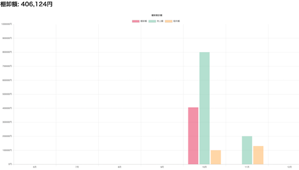

# ECサイト 棚卸しツール

* 制作期間： 3日間
* 使用技術： HTML,CSS,JS,PHP
* プロダクト紹介映像: https://youtu.be/9XpErusLM_g

テスト  テスト

### 概要
現在運営しているECサイトの実業務で行っている月毎の棚卸し額の算出を自動化するツールを作成してみました。
stock-cal/form.php にて、[stocklist.csv](https://github.com/worldwideweb13/stock-cal/blob/dc36a207a2008637d36f4a2bee9fa2dfbef1920e/stocklist.csv)の形式でcsvファイルをアップロードすると、CSVファイル内から商品の仕入値を抜き出し、累計棚卸額を算出します。
本プロダクトの着地として、自社の在庫管理をトータルで行えるツールに仕上げたいと考えております。 （リポジトリは別に用意予定）
* 2021年12月追記  本アプリの完成形としてBi-Scouterのソースを公開しました。  https://github.com/worldwideweb13/stock-cal/tree/dc36a207a2008637d36f4a2bee9fa2dfbef1920e

### 実行環境
* PHP 7.4.2
* MAMP推奨
* 利用するCSVファイル形式は[stocklist.csv](https://github.com/worldwideweb13/stock-cal/blob/dc36a207a2008637d36f4a2bee9fa2dfbef1920e/stocklist.csv)を参照して下さい。

### 開発の苦労した点
本リポジトリでは、最初のステップとして以下の2点の実装を行いました。
1. dbへのデータ取り込みの実装、
2. 自社の内部管理コードからキーワードを抽出して集計して画面描画をするアルゴリズム作成

結果、2の実装を作るのに苦労をしました。CSVファイル文字列をPHP関数を使って各列抽出、内部管理コードは文字列検索機能を使い、商品の仕入原価や店舗名コードに分割して変数化。それらを配列にしてSQLレコードを作成して挿入、、、以上の流れを繰り返し処理でループ、、という一連のアルゴリズムを実装するのに苦労しました。この経験を通し、配列、ロープ処理、関数、といった概念を体感で覚えることができたのは貴重な経験です。
